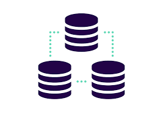

# Avaliação de Algoritmos para Hash Perceptivo
> Nesse repositório, estão armazenadas os arquivos utilizados para o desenvolvimento da pesquisa de avaliação de Algoritmos para Hash Perceptivo. Foram selecionados 6 tipos de Algoritmos de Hash Perceptivos: AverageHash, Crop-ResistanceHash, DifferenceHash, HSV-ColorHash, PerceptualHash e WaveletHash

## Experimento
### 💻 Base de Imagens para os Experimentos

  

Para o desenvolvimento do experimento, foi utilizado 5 bases de Imagens.
Todas as bases possuem uma imagem Original e outras variações da imagem Original.
O Objetivo do experimento é identificar que ambas as imagens, Original e Variações, possuem uma relação determinada pelo Hash Perceptivo.
Todas as bases de imagens estão disponíveis [nesse repositório:](https://github.com/jrafa1607/Evaluation-of-Perceptual-Hash-Algorithms/tree/main/ImageDatabase)

####  LennaDatabase e WashingtonDatabase
As Bases LennaDatabase e WashingtonDatabase foram selecionadas da publicação: <b> Images from Digital Image Processing, 3rd ed, by Gonzalez and Woods.</b> Disponível no Link: https://imageprocessingplace.com/root_files_V3/image_databases.htm
- [x] Lenna Database (21 Imagens)
- [x] Washington Database (07 Imagens)

#### PalaceDatabase e MountainDatabase
As Bases PalaceDatabase e MountainDatabase foram selecionadas na Base de Imagens: <b> SUID: Synthetic Underwater Image Dataset.</b> Disponível no Link: https://ieee-dataport.org/open-access/suid-synthetic-underwater-image-dataset
- [x] PalaceDatabase (31 Imagens)
- [x] MountainDatabase (31 Imagens)

ParkDatabase (01 Original Image and 10 Alternative): 11 Images
The ParkDatabase was selected from the Dataset: CoMoFoD - Image Database for Copy-Move Forgery Detection. Available at Link: https://www.vcl.fer.hr/comofod/download.html

Lembrando que o arquivo <b>contas</b> deve ter o nome das contas do seu ambiente AWS, o mesmo nome configurado no arquivo <b>Config</b>. Por exemplo:

#### Arquivo Contas
`<AccountName-Num1>` 
`<AccountName-Num2>`

#### Arquivo Config
`[profile <AccountName-Num1>]` 
`sso_start_url = URL` 
`sso_region = <region>` 
`sso_account_id=<ID Number>` 
`sso_role_name = <PermissionSet>` 
`output = json` 

`[profile <AccountName-Num2>]` 
`sso_start_url = URL` 
`sso_region = <region>` 
`sso_account_id=<ID Number>` 
`sso_role_name = <PermissionSet>` 
`output = json` 